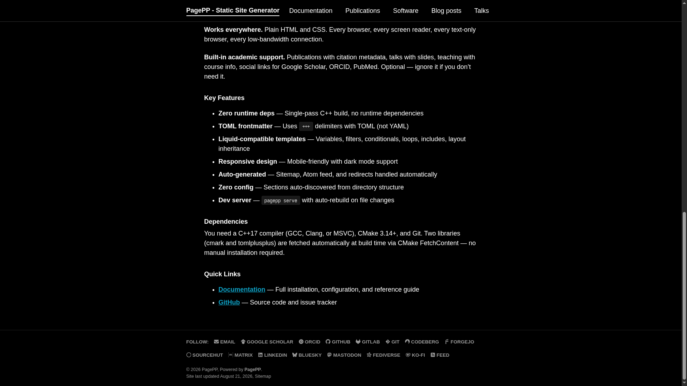
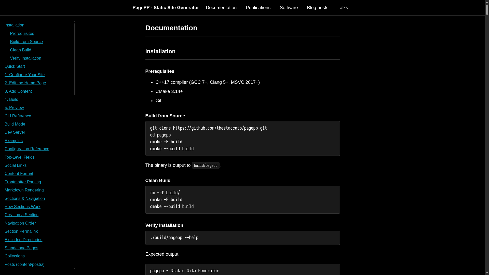

# PagePP

A fast, zero-runtime-dependency suckless static site generator. Reads Markdown content with TOML frontmatter, applies a Liquid-compatible template engine, and outputs a complete static HTML site.

Highly recommended to check out **[Full Documentation](content/documentation/index.md)**.

## Features

- **C++17** - single binary, no runtime dependencies
- **Markdown** - CommonMark-compliant via cmark
- **TOML frontmatter** - via tomlplusplus
- **Liquid templates** - variables, filters, loops, conditionals, includes
- **Collections** - posts, publications, talks, teaching, custom
- **Dev server** - auto-rebuild on file change
- **Dark mode** - automatic via `prefers-color-scheme`
- **Inline SVG icons** - no font/CDN dependencies
- **Atom feed** and **sitemap** generated automatically
- **Redirects** via frontmatter

## Usage

### NixOS

Use `nix build` to build `/result` or run directly using `nix run`.

### Other OS

    cmake -B build && cmake --build build
    ./build/pagepp              # build to public/
    ./build/pagepp serve        # dev server at localhost:8000

## CLI

    pagepp [options]              Build the site
    pagepp serve [options]        Dev server with live rebuild

    Options:
      --content <dir>    Content directory (default: content)
      --output <dir>     Output directory (default: public)
      --templates <dir>  Templates directory (default: templates)
      --port <port>      Dev server port (default: 8000, serve mode only)
      --help, -h         Show help

## Project Structure

    content/                # Markdown content + config.toml
    templates/
    layouts/              # Page layouts (single, archive, splash, talk)
    includes/             # Partials (masthead, footer, head)
    assets/
    css/main.css          # Stylesheet
    icons/                # Inline SVG icons

## Template Filters

Arguments use parentheses, not colons:

    {{ value | truncatewords(10) }}
    {{ value | default("fallback") }}
    {{ value | slice(0, 5) }}
    {{ value | remove("
") }}

Unquoted arguments resolve as variables:

    {{ page.excerpt | default(site.description) }}

## Deployment

Upload `public/` to any static host, for github just use this [CI](.github/workflows/ci.yml). 

## License

[MIT-License](LICENSE)
